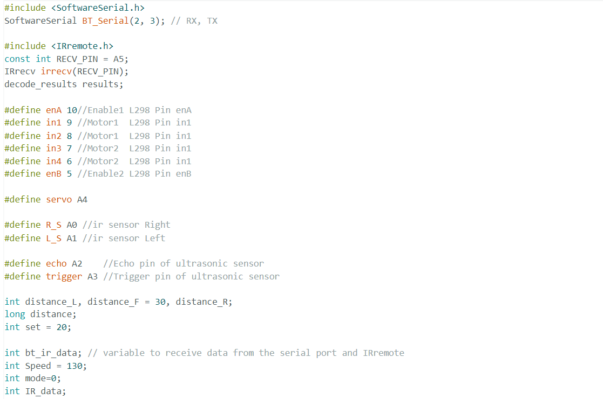

# All-in-one-Robot-Car
Hello, Everyone. This project is named as "All in one Robot Car" Cause of its capabilities and efficiency. This is an unarmed vehicle made by using IOT and Electronics components.
It can do a lot of tasks like avoiding Obstacles, Line following etc. 
# Software requires : 
1. Arduino IDE
2. MIT App inverter 
# Hardware component requires : 
1. Arduino Uno
2. Arduino Nano 
3 .5 pin flame sensor 
4. Single pin flame sensor
5. L298N 2A motor driver
6. 16×2 LCD display
7. Humidity and Temperature sensor ( DHT11) 
8. IR sensor module 
9. IR receiver module
10. Ultrasonic Sensor (HC-SR04)
11. Servo motor
12. 4 - Dual shaft BO motor 
13. 12v buzzer
14. HC05 Bluetooth module
# Code Explanation:

First of all we have to install the SoftwareSerial.h and IRremote.h library. Then we will define the variable and constant input and output pins,IR receiver pin as A5 and motor driver pins enA,enB, motor1 and motor2. As well as the servo and ultrasonic sensor trigger and echo pins.Bluetooth input data as bt_ir_data.

# Instructions: 
I usually prefer PCB Design rather than Breadboard and wires. Cause of its compactness and durability. 
After connecting according to the circuit first upload the Arduino Nano code to Arduino Nano. Info - you should install the DHT11 library and liquidcrystal.h in your Arduino IDE Software. Then the LCD display should show the current humidity and temperature. Also the flame sensor should react with the buzzer while it detects fire. 
The next step is to upload the Arduino uno.ino code to Arduino uno. Remember to plug out the RX,TX pin of the HC05 while uploading the code. Don't connect the Vcc of the HC05 from Arduino 5v pin, give a seperate power supply of 5v orelse when your battery will be at die stage it may not work properly and will get shutdown again and again. 
# Disclaimer:
1. Overuse of battery may damaged to Arduino board
2. Don't on the battery while the Arduino is connected to laptop via USB port( max input voltage of Arduino is 12v) 
3. Give extra power supply to both motor driver and HC05
4. If the APK  crashes irregularly then make sure your Bluetooth is on, close the apk and open again. Make sure you have give all the permission to the apk. If all the above conditions are matched please uninstall and reinstall it. 
5. Recommendation is to give 5v power supply of all sensor and the LCD display from individual power supply not from Arduino it may cause delay and Overload to the Arduino . 
# Advantages and Features:
1. Obstacles Avoiding.
2. Line Following.
3. Manual Controlled by Android.
4. Voice controlled by google assistant.
5. Gesture controlled. 
6. Diplays Current Humidity and Temperature.
7. Flame Avoidance and Alert. 
8. IR remote controlled.
It can be used for any shopping mall, as well as home purpose to carry and reach out the things at right place and can be an assistant to blind and deaf people to save them from fire. 
# Disadvantages : 
1. High power consumption
2. Battery runtime up to 1 hour only ( if use 2 × 3.7V battery)
3. Hardware components may get damaged due to over usage 
4. Due to Bluetooth modules there is latency.
