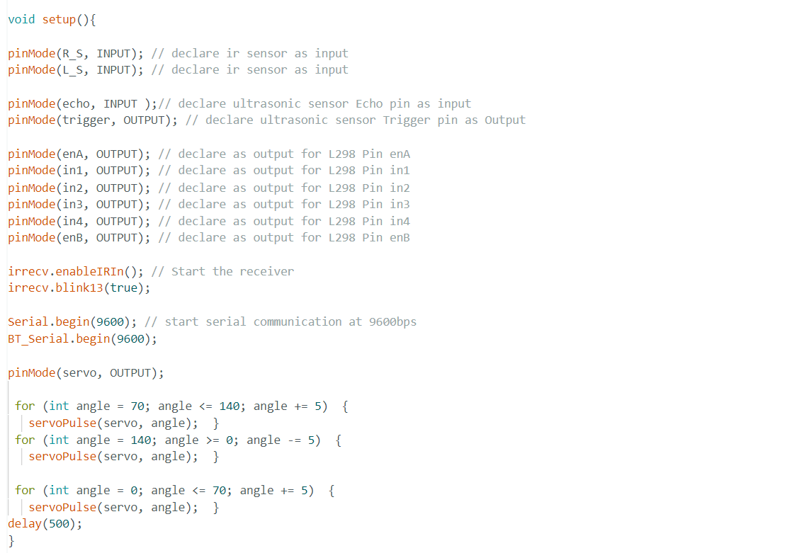
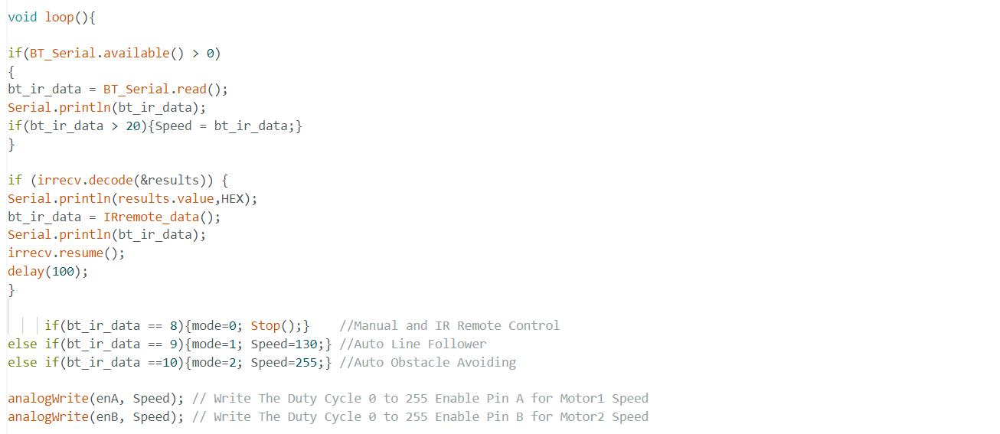
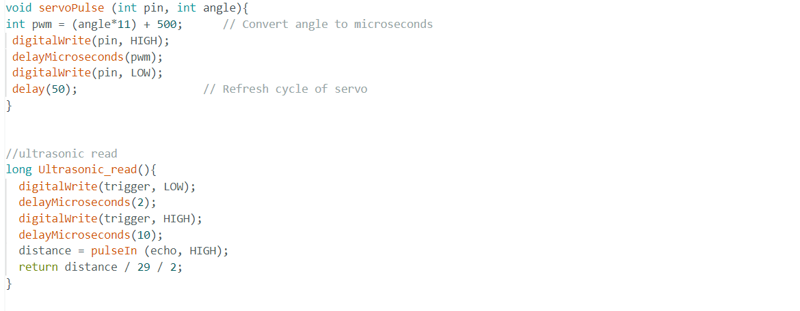
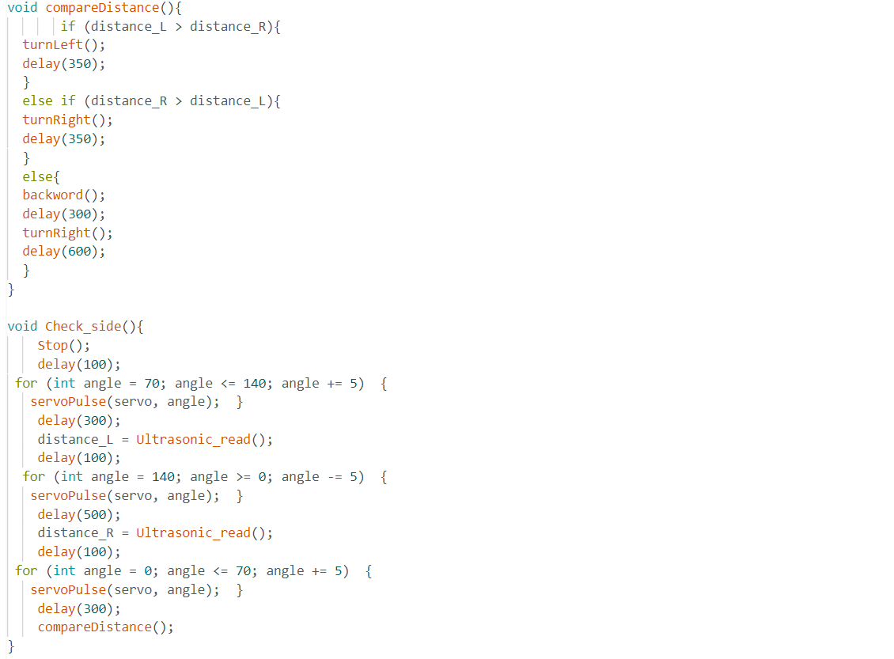

# All-in-one-Robot-Car
Hello, Everyone. This project is named as "All in one Robot Car" Cause of its capabilities and efficiency. This is an unarmed vehicle made by using IOT and Electronics components.
An obstacle avoiding robot is a fully autonomous robot which can be able to avoid any obstacle which it faces when it moves. Simply, when it met an obstacle while it’s moving forward, automatically stop moving forward and makes a step back. Then it looks it's two sides left & right and starts to move the best possible way, which means either in left direction if there is another obstacle in right or in right direction if there is another obstacle in left side. The obstacle avoiding robot is very helpful and it is the base of many large projects such as Automatic cars, robots used in Manufacturing factories, even in robots used in spacecrafts.

A line tracking robot use some infrared proximity sensors to detect the line and based on input received from the sensors, the Arduino will direct the motors to move with the help of a motor drive.

A Following robot use proximity sensors that can detect any object near it and can follow this object. If you come in front of the robot it will start following you. this robot consists ultrasonic sensor and ir sensor which help to follow the object. This is like the obstacle avoiding robot only but opposite in the working. It used 2 IR sensors and an ultrasonic sensor. IR sensors used to follow the human or object and ultrasonic sensor is used to move back the robot.

A Bluetooth Robot can be controlled through a Bluetooth device connected to Arduino. I developed an Android App that can control robot direction and activate action mode.
# Software requires : 
1. Arduino IDE
2. MIT App inverter 
# Hardware component requires : 
1. Arduino Uno-https://www.amazon.in/Arduino-Uno-ATmega328P-USB-Cable/dp/B01LCN8IRK/ref=sr_1_4?keywords=arduino&qid=1677779967&sr=8-4
2. Arduino Nano 
3 .5 pin flame sensor 
4. Single pin flame sensor
5. L298N 2A motor driver
6. 16×2 LCD display
7. Humidity and Temperature sensor ( DHT11) 
8. IR sensor module 
9. IR receiver module
10. Ultrasonic Sensor (HC-SR04)
11. Servo motor
12. 4 - Dual shaft BO motor 
13. 12v buzzer
14. HC05 Bluetooth module
# Code Explanation:

First of all we have to install the SoftwareSerial.h and IRremote.h library. Then we will define the variable and constant input and output pins,IR receiver pin as A5 and motor driver pins enA,enB, motor1 and motor2. As well as the servo and ultrasonic sensor trigger and echo pins.Bluetooth input data as bt_ir_data.

Now the void setup function,here we will define the mode of the input and output pin using pinMode syntax.
The seial begin arduino port with the command Serial.begin(9600) and the serial connection with bluetooth using BT_Serial.begin.Also the rotating and checking angle of servo motor, i kept it as 0 to 140, it can be coustomized no issue.

In void loop section first we will decode the bluetoooth inputs using irrecv,decode(&results) command. the the if else condition according to the bluetooth input serial,ex-if 8 then it will be in manual mode,9 for Auto line follower and 10 for the obstacle avoiding mode.

Under the if statement of mode 0 that is manual mode if the bt_ir_data ==1,bt_ir_data ==2,bt_ir_data ==3,bt_ir_data ==4,bt_ir_data ==5 then will implement the forward,backward,turnleft,turnright and stop respectively.As well as mode 1 and mode 2.

Defined servopulse and covert angle to microseconds for refresh cycle of servo by defining a integer as pwm.
Also takes the ultrasonic readings by defining Ultrasonic_read() and giving the trigger pin once high and low, and echo pin as output.

By defining a function as compareDistance() we have inserted our logical statements for obstacle avoiding by comparision of each side readings of ultrasonic sensor like when the left side distance is higher then surely no object is at left side then the robot will move towards left side, and vice verca too. if both not the robot will move on backward side.
Also defined Check_side() for rotating the ultrasonic sensor by the rotation of servo motor.

Last of all defined 5 functions as forward(),backward(),turnRight(),turnLeft() and stop() for controlling the motors as requires.
# Instructions: 
I usually prefer PCB Design rather than Breadboard and wires. Cause of its compactness and durability. 
After connecting according to the circuit first upload the Arduino Nano code to Arduino Nano. Info - you should install the DHT11 library and liquidcrystal.h in your Arduino IDE Software. Then the LCD display should show the current humidity and temperature. Also the flame sensor should react with the buzzer while it detects fire. 
The next step is to upload the Arduino uno.ino code to Arduino uno. Remember to plug out the RX,TX pin of the HC05 while uploading the code. Don't connect the Vcc of the HC05 from Arduino 5v pin, give a seperate power supply of 5v orelse when your battery will be at die stage it may not work properly and will get shutdown again and again. 
# Disclaimer:
1. Overuse of battery may damaged to Arduino board
2. Don't on the battery while the Arduino is connected to laptop via USB port( max input voltage of Arduino is 12v) 
3. Give extra power supply to both motor driver and HC05
4. If the APK  crashes irregularly then make sure your Bluetooth is on, close the apk and open again. Make sure you have give all the permission to the apk. If all the above conditions are matched please uninstall and reinstall it. 
5. Recommendation is to give 5v power supply of all sensor and the LCD display from individual power supply not from Arduino it may cause delay and Overload to the Arduino . 
# Advantages and Features:
1. Obstacles Avoiding.
2. Line Following.
3. Manual Controlled by Android.
4. Voice controlled by google assistant.
5. Gesture controlled. 
6. Diplays Current Humidity and Temperature.
7. Flame Avoidance and Alert. 
8. IR remote controlled.
It can be used for any shopping mall, as well as home purpose to carry and reach out the things at right place and can be an assistant to blind and deaf people to save them from fire. 
# Disadvantages : 
1. High power consumption
2. Battery runtime up to 1 hour only ( if use 2 × 3.7V battery)
3. Hardware components may get damaged due to over usage 
4. Due to Bluetooth modules there is latency.
